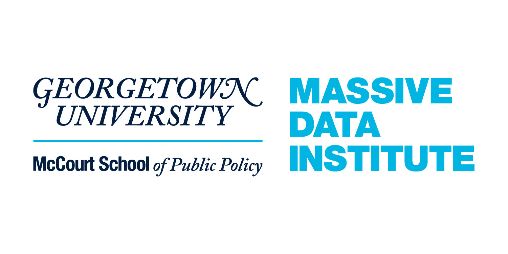

# Topic Models: A Practical Introduction in Python
## A workshop with the [Massive Data Institute](https://mccourt.georgetown.edu/research/the-massive-data-institute/), Georgetown University

[](https://mybinder.org/v2/gh/jhaber-zz/topic-models-2022/HEAD)


## Overview

Topic models are among the most popular techniques in natural language processing (NLP), a versatile tool for understanding the latent themes in text that has been widely applied to websites, books, school applications, social media, and everything else. Topic models analyze word co-occurrences within and across documents to discover the topics that generated them, the topics’ component words, and their distribution over a corpus. This workshop will give you hands-on experience with a typical topic modeling workflow, including text preprocessing and model construction and evaluation. Basic familiarity with Python is required; prior experience with NLP is useful but not required.


## Workshop goals

_Day 1:_ 
* Think through how and why you might use topic modeling in a text analysis project
* Implement a basic topic modeling algorithm and learn how to tweak it
* Understand the intuitions behind Latent Dirichlet Allocation (LDA) for topic modeling
* Get familiar with (some of) Python's versatile `scikit-learn` library
* Get familiar with the Pandas package and manipulating data
* Learn how to prepare a Document-Term Matrix (DTM), why this is useful, and what "bag of words" means

_Day 2:_
* Understand Term Frequency–Inverse Document Frequency (TF-IDF) scores and why they are useful
* Understand different methods to calculate topic prevalence
* Learn how to create some simple graphs with topic prevalence
* Learn how to visualize topics with word clouds and pyLDAvis


## Prerequisites

We will get our hands dirty implementing topic modeling at a fairly basic level. To follow along with the code—which is the point—will need some familiarity with Python and Jupyter Notebooks. If you haven't programmed in Python or haven’t used Jupyter Notebooks, please do some self-teaching before this workshop using resources like those listed below. 


## Code Details

These notebooks are designed to serve as teaching aids, not as serious text analysis tools. That said, they are a good place to start if you are considering using topic modeling for your research.

The main libraries used in this repository are:
* [Pandas](https://pandas.pydata.org/)
* [Scikit-learn](https://scikit-learn.org/stable/)
* [Natural Language Toolkit](https://www.nltk.org/) (NLTK)
* [pyLDAvis](https://github.com/bmabey/pyLDAvis)
* [tmtoolkit](https://tmtoolkit.readthedocs.io/en/latest/) (a bit)
* [wordcloud](https://amueller.github.io/word_cloud/)
* [Matplotlib](https://matplotlib.org/)


## Getting started & software prerequisites

For simplicity, just click the "Launch Binder" button to create a virtual environment ready for this workshop. 

If you want to run the code on your computer, you have two options. You could use [Anaconda](https://www.anaconda.com/what-is-anaconda/) to make installation easy: [download Anaconda](https://www.anaconda.com/download/). 

The other option is to clone this repository, install all the libraries locally, and work along on your own machine. If you already have Python 3.x installed with the full list of libraries listed under `requirements.txt`, you may be ready to go. But I suggest creating a virtual environment to keep all the dependencies contained. To do that, run these commands:

```
# Create virtual environment named '.TM-env'
python3 -m venv .TM-env
source .TM-env/bin/activate

# Install dependencies, from inside cloned repo folder
pip3 install -r requirements.txt

# When done, deactivate virtual environment
deactivate
```


## Open-Access, Online Resources on Python and NLP

_Introductory:_
* [Introduction to Jupyter Notebooks (Real Python)](https://realpython.com/jupyter-notebook-introduction/)
* [Guide to running Jupyter Notebooks locally (not via Binder)](https://www.datacamp.com/community/tutorials/tutorial-jupyter-notebook)
* [Quick Python intro (a Jupyter Notebook)](https://github.com/jhaber-zz/nlp-python-2020/blob/master/solutions/intro-to-python.ipynb)
* [Official Python Tutorial](https://docs.python.org/3/tutorial/index.html)
* [Intro to SpaCy and NLP concepts (Allison Parrish)](https://gist.github.com/aparrish/f21f6abbf2367e8eb23438558207e1c3)
* [Workshops on NLTK and SpaCy (Geoff Bacon @ D-Lab)](https://github.com/geoffbacon/nlp-with-nltk-spacy)

_In-depth:_
* [NLP textbook (Jurafsky & Martin @ Stanford)](https://web.stanford.edu/~jurafsky/slp3/)
* [Book on NLTK (NLTK team)](http://www.nltk.org/book/)
* [NLP course & scripts, for social scientists & digital humanists (Laura Nelson)](https://github.com/lknelson/text-analysis-course)
* [Great book on Python (with exercises): “Python for Everybody” (Charles Severance)](https://www.py4e.com/book.php)
* [Python Programming for the Digital Humanities (Folgert Karsdorp)](http://www.karsdorp.io/python-course/)
* [Jupyter notebooks on Literary Text Analysis (Stéfan Sinclair)](https://github.com/sgsinclair/alta/blob/master/ipynb/ArtOfLiteraryTextAnalysis.ipynb)

_Resource collections:_
* [Datasets for NLP (Hugging Face)](https://github.com/huggingface/datasets)
* [Tons of resources on learning Digital Humanities (Scott B. Weingart)](https://scottbot.net/teaching-yourself-to-code-in-dh/)
* [Python tutorials for social scientists (Neal Caren)](https://nealcaren.github.io/python-tutorials/)


## Contributing

If you spot a problem with these materials, please make an issue describing the problem.


## Acknowledgments

* [D-Lab at the University of California, Berkeley](https://dlab.berkeley.edu/)
* [Cambridge Digital Humanities](https://www.cdh.cam.ac.uk/), especially [this workshop](https://github.com/mchesterkadwell/intro-to-text-mining-with-python)
* [Laura Nelson](http://www.lauraknelson.com), especially [her CTA course](https://github.com/lknelson/text-analysis-course) and [this workshop](https://github.com/lknelson/text-analysis-course/blob/master/scripts/04.03.01_IntroductionToTopicModeling.ipynb)
* [Geoff Bacon](https://geoffbacon.github.io/)
* [Ben Gebre-Medhin](http://gebre-medhin.com)
* [David Bamman](https://people.ischool.berkeley.edu/~dbamman/)
* [Summer Institute in Computational Social Science](https://sicss.io/)

<br>


